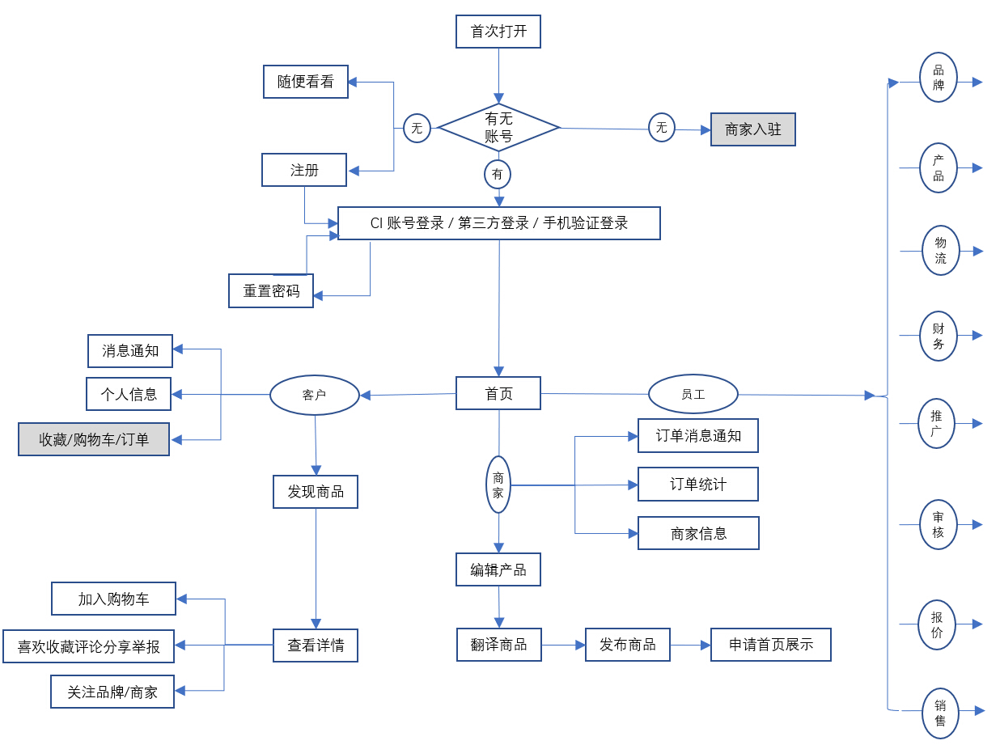

## [返回目录](../readme.md)  

### [4. 产品架构](./4_Structure.md)  &nbsp;&nbsp;&nbsp;&nbsp; [<<上一章（产品简介）](./3_Description.md) [下一章（详细功能）>>](./5_Function.md)
---
#### 4.3 总体流程图 &nbsp;&nbsp;&nbsp;&nbsp; [<<上一节（产品结构图）](./4_Z2.md) [下一节（订单流程简图）>>](./4_Z4.md)
  
