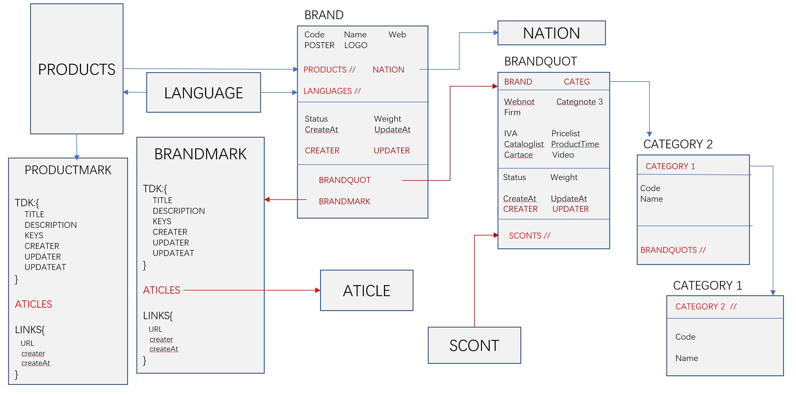

## [返回目录](../../readme.md)  
#### 品牌 &nbsp;&nbsp;&nbsp;&nbsp; [返回功能列表](../5_Function.md)
---
###### 品牌字段说明

 - 品牌基本信息 (brand)

	品牌编号(code)

	品牌名字(name)
	
	品牌海报(poster)
	
	品牌logo(logo)

	品牌类型（brandCategory）<关联类型数据库>

	品牌所属国家 （nation）<关联国家数据库>

	品牌网站(web)

	品牌语言(brandLangs)

	状态 （status)[正常， 标记灰色， 标记黄色， 标记绿色]

	权重 （weight)[品牌的重要性，及排列顺序]

	产品 (products) <关联品牌下的所有产品>

	创建/更新 时间/人 (createAt updateAt creater updater)[更新时间和人最好用数组表示，以便查询]

	关联品牌到采购信息(brandQuot) <关联brandQuot数据库> [只有品牌部报价部能访问]

	关联品牌SEO (brandMark) <关联brandMark数据库> [只有市场部SEO能看到]

- 品牌关于报价部的信息，用于采购联系品牌 (brandQuot)
	
	与基本信息关联(brand)<关联brand数据库>

	品牌类型备注 （categoryNote）[可能有些类型太特殊，不需要录入数据库，在此相当于三级类型分类]

	品牌网站备注 （webNote）[用来存放该品牌网站的登录信息]

	品牌所属公司名 (firm)

	税 (iva)

	价格单 (pricelist) [布尔类型， 只是说明有无价格单]

	价格单备注 (pricelistNote)

	图册集 (cataloglist) [布尔类型， 只是说明有无图册集]

	图册集备注 (cataloglistNote)

	生产周期 （此品牌的生产周期）

	折扣信息(scont) <关联scont数据库>

- 品牌关于市场部的信息，用于SEO等 (brandMark)
	
	与基本信息关联(brand)<关联brand数据库>

	品牌tdk (tdk) {title, description, keys, creater, editer, updater} [tdk编辑者有权利编辑]

	文章 (articles) <链接所有有关此品牌的文章> [所有公司编辑的有关此品牌的文章链接]

	品牌外链 (links) {linkUrl, platform, editer, createAt} [所有外链链接, 外链发布者发布后，需要编写一些信息到这，以便查看]

###### 提示建议
> 安全起见，最好能把品牌的公开信息和私密信息分离，用两个数据库关联

###### 权限说明
- brand基本信息是给所有人看的
- brandQuot 只有品牌部和报价部可以访问编辑
- brandMark 只有市场部能访问编辑, 市场部又分为tdk权限 文章编辑权限 外链权限

###### 品牌架构建议

