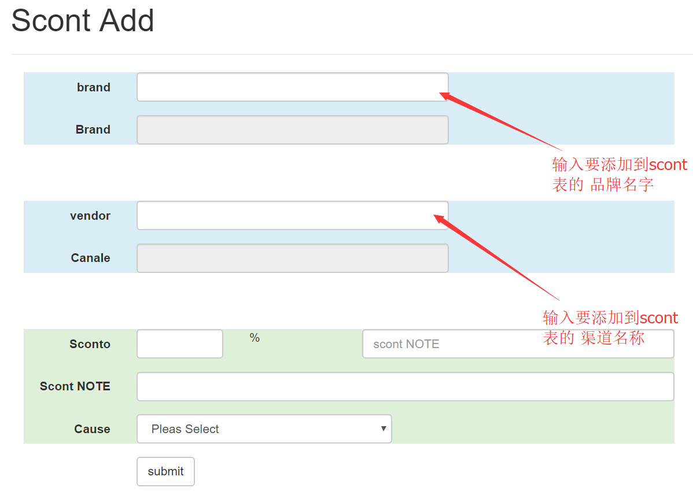
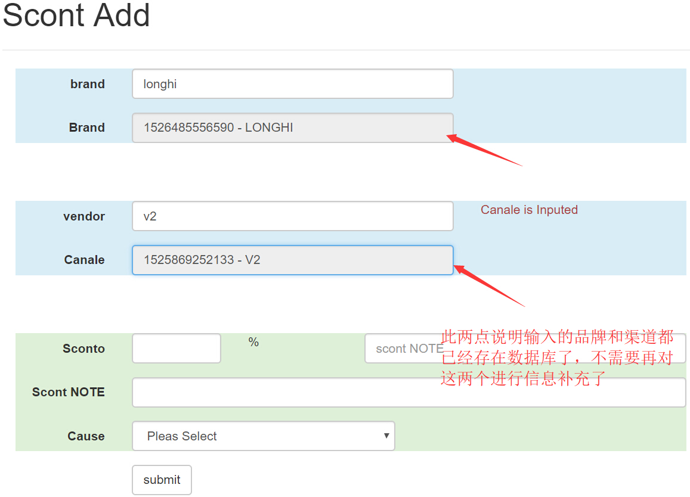
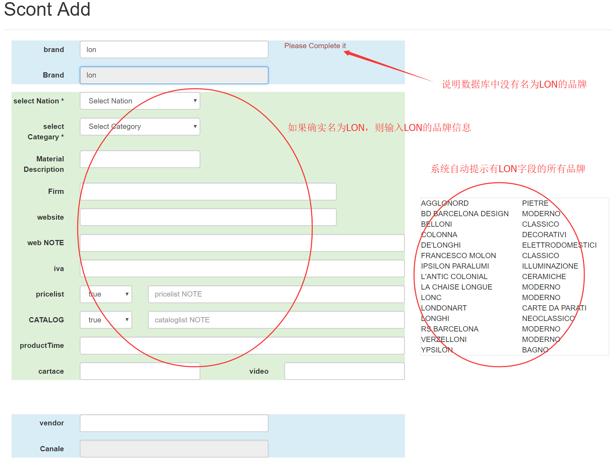
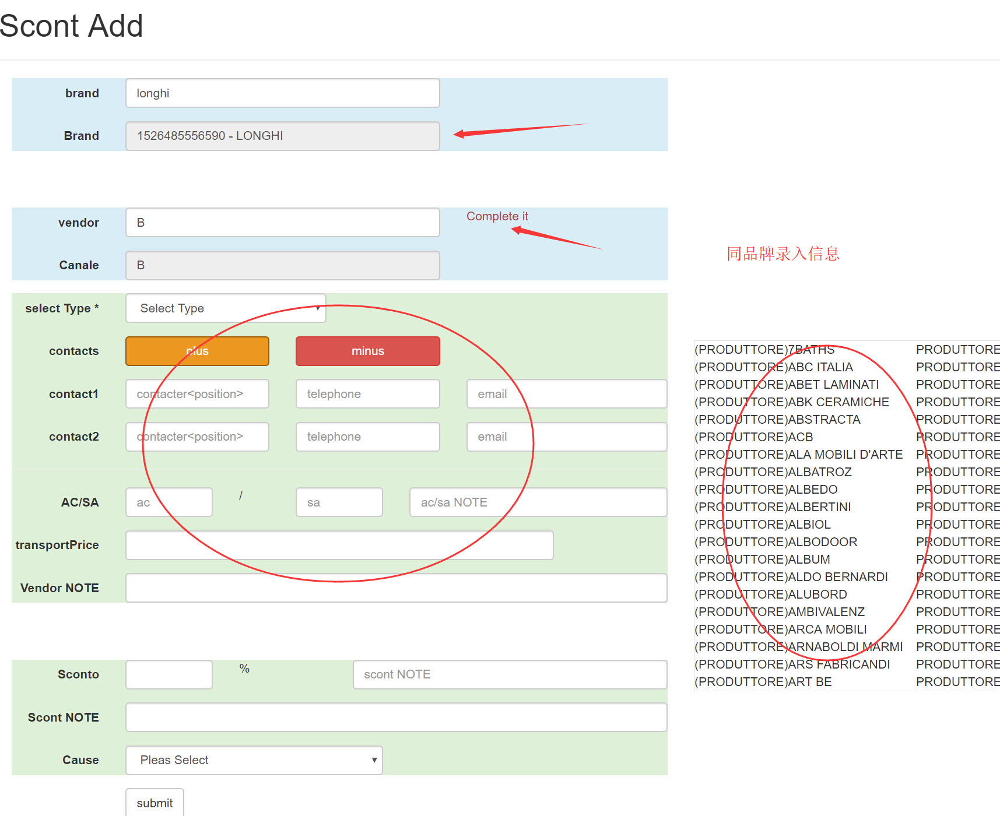
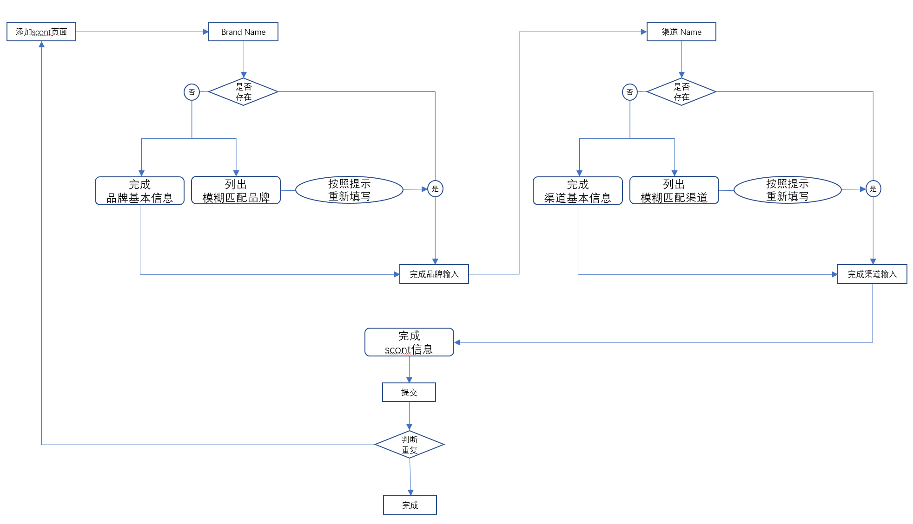

## [返回目录](../../readme.md)  
#### 新增scont &nbsp;&nbsp;&nbsp;&nbsp; [返回功能列表](../5_Function.md)

 ---
 ###### 需求说明
- 1 添加scont时，输入品牌名称是 如果该品牌已经存在数据库中，品牌信息自动填充好，不必重复手动填写信息
- 2 输入时如果没有填写的品牌名，则系统自动弹出与输入字符模糊匹配的品牌，防止员工输入错误信息
- 3 输入渠道信息 品牌
- 4 如果输入的品牌已经存在，渠道也存在，那么判断该品牌下是否已经有了该渠道，如果已经有了那么此记录不能录入系统
- 5 三个数据库 brand vendor scont 提交时，只有一个按钮，但是要录入三个信息进入不同的数据库，不可先录完品牌信息，再录渠道信息，再录入两者之间的折扣
- 6 能够查询各个品牌类型中所有品牌的数量，也能够查询各个品牌所属国家中所有品牌的数量

---
##### 原型图
- 添加scont的初始界面

- 品牌和渠道全部已经存在于数据库中的情况

- 添加新品牌

- 品牌存在于数据库，新增渠道

---
##### 流程图

