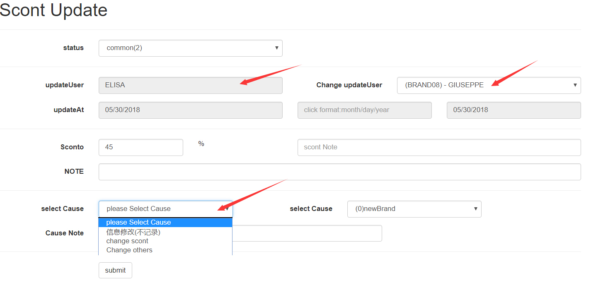
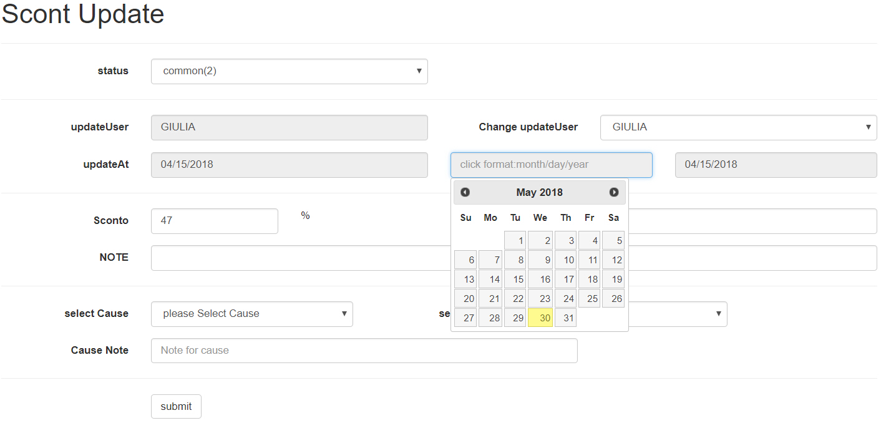

## [返回目录](../../readme.md)  
#### scont修改 &nbsp;&nbsp;&nbsp;&nbsp; [返回功能列表](./1.md)
---
###### 需求说明
- 1 上一小节，我们说过，scont信息全公司都在使用，不能随意修改
- 2 如果必须修改，比如信息录入错误，审核的时候没有发现，或者渠道联系人修改了信息，或者品牌更换了新名字，或者厂商更新了折扣
- 3 既然普通员工不能随意修改，那么我们设立一个可以修改信息的员工，（审核者也拥有该权限）
- 4 有个问题就是员工A得到的更新信息，但是他没有更新权限，那么A就会去找修改者B，B把scont更新了，但是更新人不是B而是A
- 5 所以修改者还有权限 改变scont的更新人
- 6 有些折扣更新是预知的，比如厂商告诉我们下个月我们的折扣要变动，所以修改这也可以修改scont的更新时间
---
##### 原型图
- 联系人更新

- 修改更新时间

