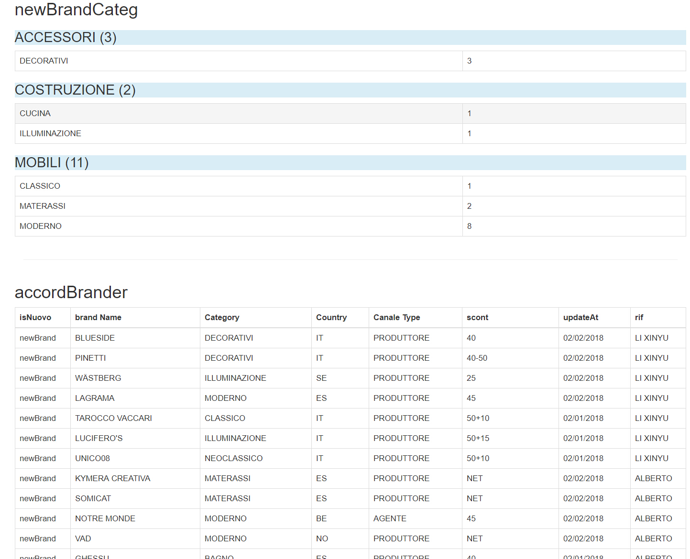

## [返回目录](../../readme.md)  
#### 报告 &nbsp;&nbsp;&nbsp;&nbsp; [返回功能列表](../5_Function.md)
---
###### 需求说明
- 1 手动做报告太耗费时间，系统自动做报告
- 2 常用的报告，有单独的按钮，如 日报告 周报告 月报告
- 3 选择日期做报告，只需要选择起始日期和终止日期，期间的所有数据自动输出
- 4 报告包括 期间内 新品牌的总量 添加scont表的原因 比如转经销商 转代理 转厂商 还有折扣修改等
- 5 报告还要根据添加/更新人列举数目等信息
- 6 折扣还要根据品牌分类的类别显示此段时间内 新品牌的数量

---
##### 原型图
- 报告按钮

- 报告内容

