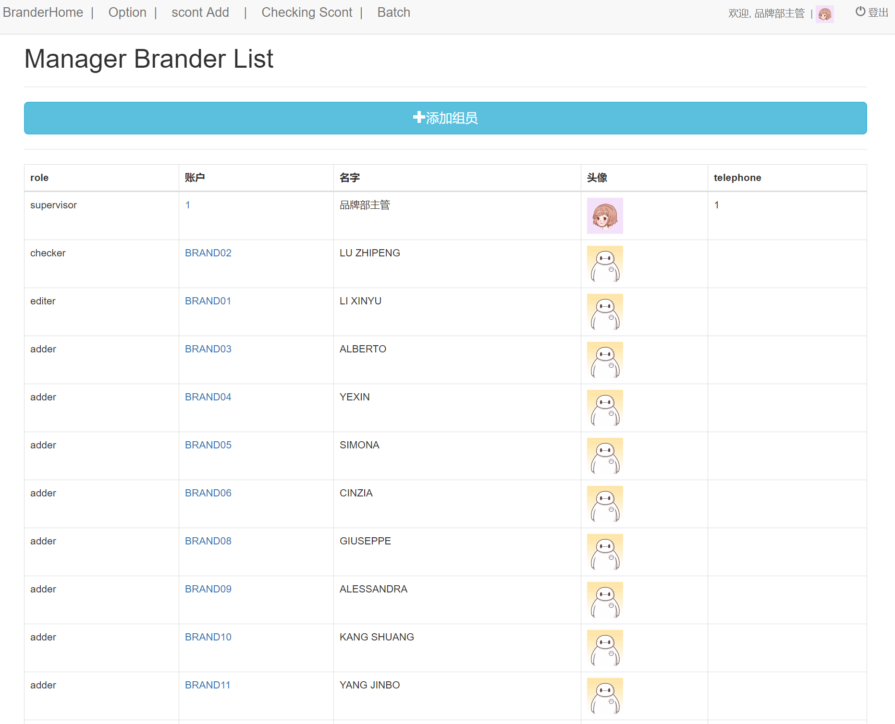

## [返回目录](../readme.md)  
#### [返回功能列表](./1.md)
---
###### 权限说明
- 主管：可以查看所有员工信息，查看员工列表，可以添加，修改员工。有品牌部最高权限
- 审核者，员工提交的品牌信息由他审核。最主要是审查品牌信息的正确性，只有被此权限审核过的品牌才能被全公司看到
- 编辑者，可以修改品牌的信息，因为不能随意编辑，所以做一个可以编辑品牌的员工，可以修改的信息有更新时间和更新人（更新者为提供信息者，大部分为添加者，因为添加者不能修改信息，所以要把信息告诉修改者，让修改者修改，但是编辑人要改成提供信息的人）
- 添加者，品牌信息
- 离职者，不可以登录，但要保留个人信息
 备注： 以上权限由高到低，权限高的拥有权限低者的权限
 ---
 ###### 需求说明
 - 用户编辑个人资料，修改昵称，联系方式，密码等 当非主管用户修改自己密码的时候需要输入原密码
 - 主管编辑员工信息，同上，只是修改密码的时候不需要原密码匹配
 ---
 ##### 原型图
 - 主管查看员工列表
 
