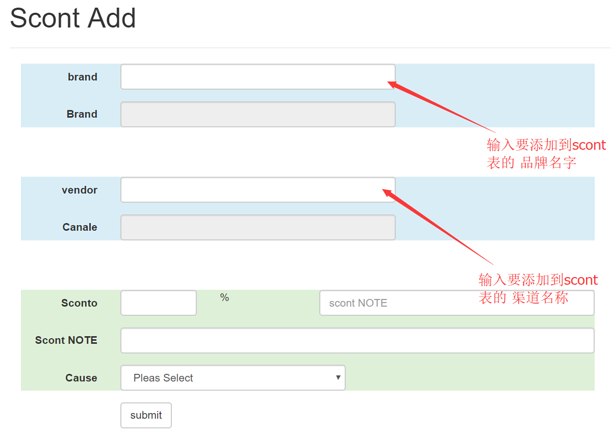
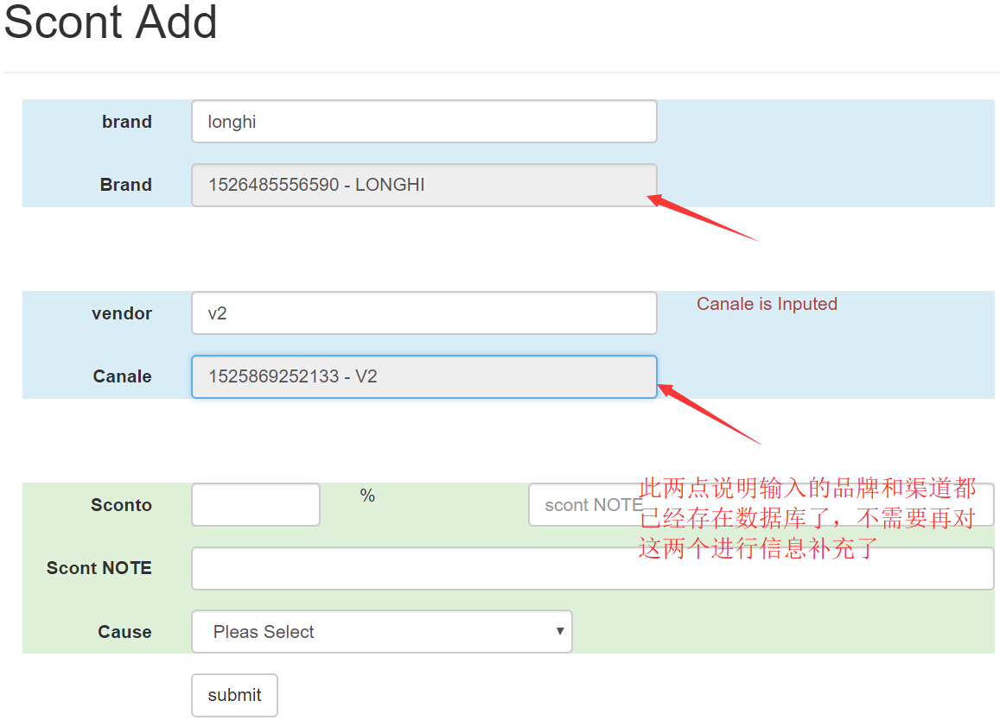
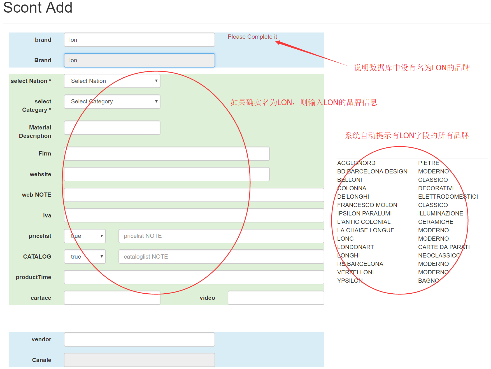

## [返回目录](../../readme.md)  
#### scont核查 &nbsp;&nbsp;&nbsp;&nbsp; [返回功能列表](./1.md)
---
###### 需求说明
- 1 因为全公司员工都要使用，所以必须确保录入信息的正确性
- 2 报价部没有时间确保自己录入信息的正确性，报价部的工作重点不在此，所以需要一个特定的品牌审查 确保录入信息的正确性
- 3 无论任何人添加了新品牌 或 品牌新渠道 都需通过审核者的审核
- 4 已经添加提交的信息，如果没有通过审核，虽然录入了数据库，但是普通员工是看不到的。
- 5 审核者有个专门的链接 查看未被审核的信息
---
##### 原型图
- 添加scont的初始界面

- 品牌和渠道全部已经存在于数据库中的情况

- 添加新品牌

- 品牌存在于数据库，新增渠道

---
##### 流程图

