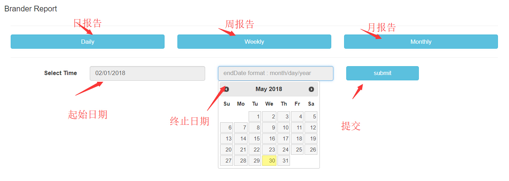

## [返回目录](../../readme.md)  
#### 报告 &nbsp;&nbsp;&nbsp;&nbsp; [返回功能列表](./1.md)
---
###### 需求说明
- 1 能够让员工给scont标记状态
- 2 标记灰色，则表示公司暂时不用此scont
- 3 还可以标记绿色和黄色状态，还应该加入delete状态，因为公司不会删除任何非错误信息，如果永远也不会联系则标记delete状态
- 4 关于灰色，如果我们公司不跟某个渠道联系，则渠道标记灰色，所有跟该渠道有关的scont全部自动标记灰色。品牌同样

也就是说，如果渠道标灰，那么在品牌下查询scont所有该渠道都是灰色的

- 5 scont表还应该有灰色scont列表 黄色scont列表 绿色scont列表的分类
- 6 品牌列表 还应该有重要品牌 灰色品牌 渠道同样
- 7 可以根据品牌的名字 其他信息 搜索到品牌， 可以根据渠道的名字 联系人名字 联系电话 等方式查询到渠道

---
##### 原型图
- 报告按钮

- 报告内容

